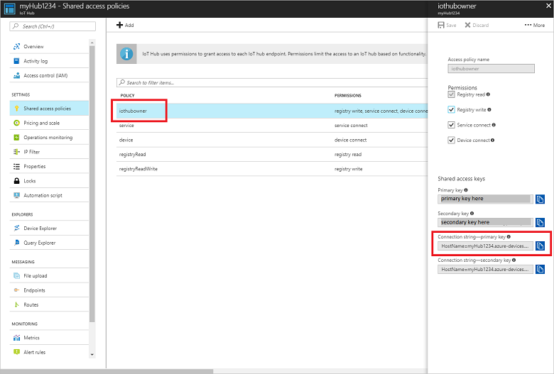
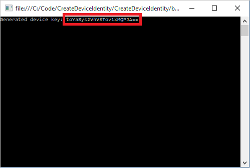
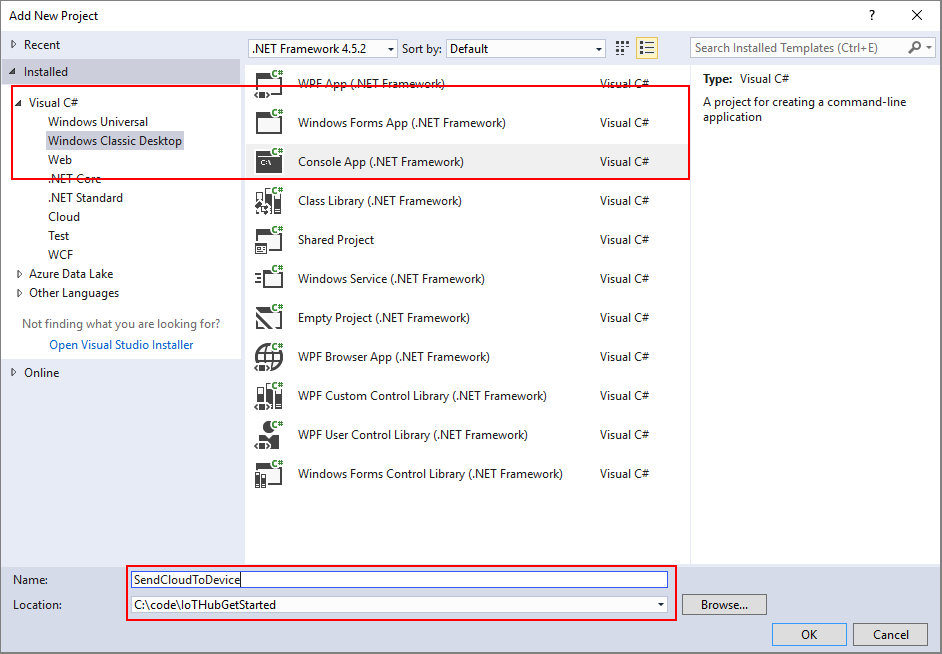
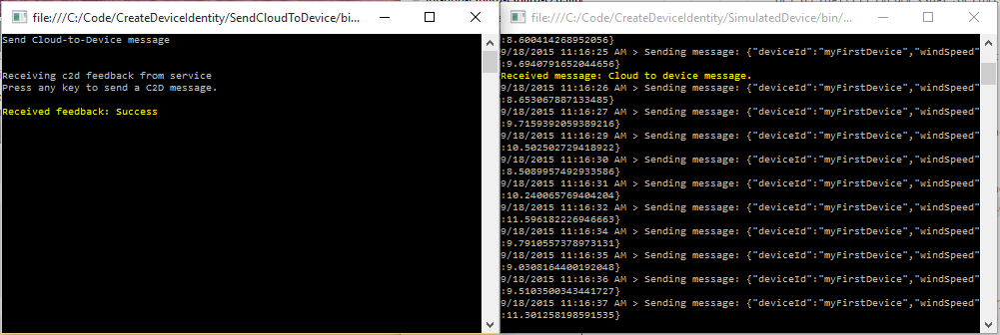
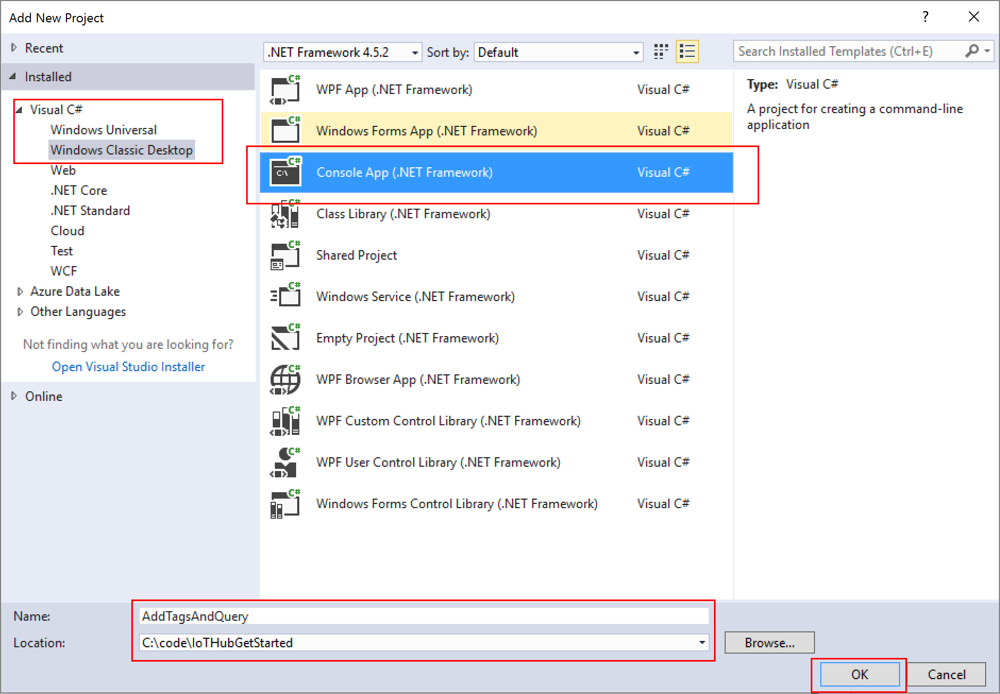
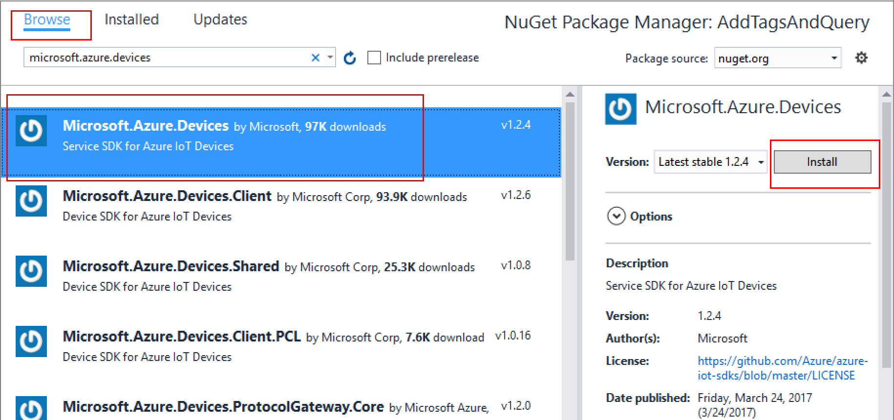
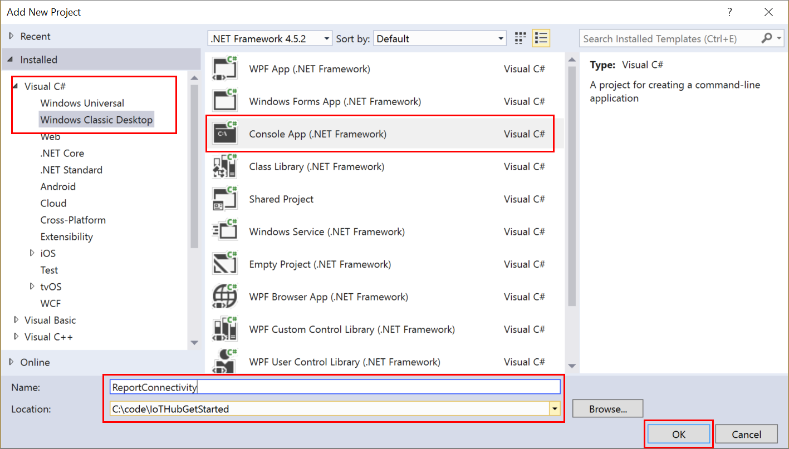
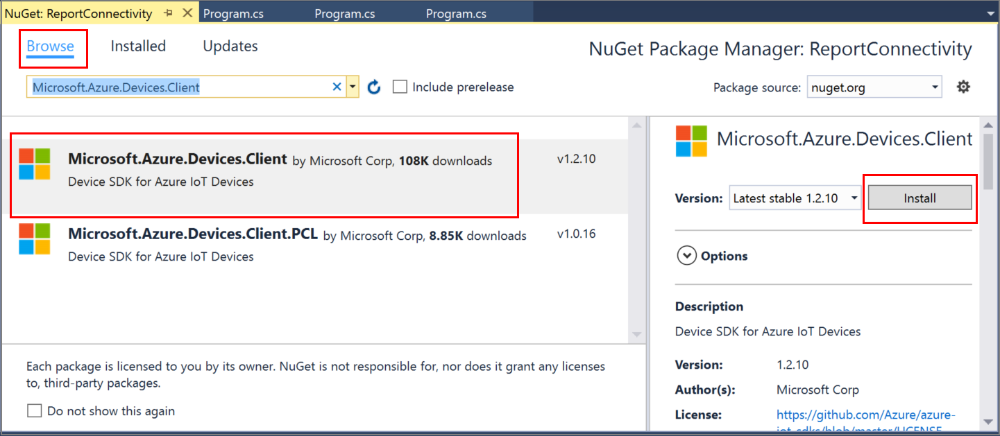

# Azure云端对设备的管控

## 实验目标

通过本实验，可以了解到如何从Azure 云端下发消息到指定设备上，以及使用Azure 的Twins 技术对设备进行查询和管控。

## 实验一：准备环境

Azure IoT Hub是完全托管的Azure服务。 这项服务实现了数百万物联网（IoT）设备与解决方案后端之间可靠，安全的双向通信。 物联网项目面临的最大挑战之一是如何可靠和安全地将设备连接到解决方案后端。 为了应对这一挑战，IoT Hub可以帮助用户做到以下事情：

+ 提供可靠的设备到云端和云端到设备的超大规模消息。
+ 使用每设备安全凭证和访问控制启用安全通信。
+ 包含最流行语言和平台的设备库。

在本实验结束后，您会创建三个.NET控制台应用程序：

+ CreateDeviceIdentity，创建一个设备身份和关联的安全密钥来连接你的设备应用程序。
+ ReadDeviceToCloudMessages，显示您的设备应用程序发送的遥测数据。
+ SimulatedDevice，使用之前创建的设备标识连接到您的IoT Hub，并通过使用MQTT协议每秒发送一个遥测消息。

实验所需要的工程代码，可以[从这里下载](https://github.com/Azure-Samples/iot-hub-dotnet-simulated-device-client-app/archive/master.zip)

在获得了实验必备的工程代码之后，需要配置一下IoT Hub 的连接字符串。请登录Azure 管理门户，然后查看IoT Hub 的连接字符串，如下图所示：



IoT Hub 根据不同的使用需求，预制了多个连接字符串，iothubowner 拥有较高权限，可以创建IoT 设备ID，device 主要是用做设备与IoT Hub 服务之间的连接。

用Visual Studio 打开CreateDeviceIdentity 项目，打开Program.cs 文件，并将iothubowner 连接字符串复制到下面代码的ConnectionString 变量中：

```C#
    public class Program
    {
        private static RegistryManager _registryManager;
        private const string ConnectionString = "{iot hub connection string}";
```
然后编译、运行CreateDeviceIdentity 程序，Main函数会调用AddDeviceAsync() 函数创建一个ID 为“myFirstDevice”的设备，代码如下：

```C#
        private static void Main(string[] args)
        {
            OptIn();
            _registryManager = RegistryManager.CreateFromConnectionString(ConnectionString);
            AddDeviceAsync().Wait();
            Console.ReadLine();
        }

        private static async Task AddDeviceAsync()
        {
            Device device;
            try
            {
                device = await _registryManager.AddDeviceAsync(new Device(DeviceId));
                SendTelemetry("success", "register new device");
            }
            catch (DeviceAlreadyExistsException)
            {
                device = await _registryManager.GetDeviceAsync(DeviceId);
                SendTelemetry("success", "device existed");
            }
            catch (Exception e)
            {
                SendTelemetry("failed", $"register device failed: {e.Message}");
                Console.WriteLine($"register device failed: {e.Message}");
                throw;
            }

            Console.WriteLine($"device key : {device.Authentication.SymmetricKey.PrimaryKey}");
        }
```

在类似下面的运行结果中记录下Device 的Key：




## 实验二：从云端下发数据到设备

用Visual Studio 打开 SimulatedDevice 项目，这个项目是用来在桌面上模拟一个IoT 设备的客户端。使用这个简单的模拟程序可以方便开发者测试数据的收发。

首先需要把IoT Hub 的URI和上一个步骤创建的设备的Key 的值添加到Program.cs 文件中：

```C#
        private const string IotHubUri = "{iot hub hostname}";
        private const string DeviceKey = "{device key}";
```


下面打开Program.cs 文件，添加从IoT Hub 接受消息的函数：

```C#
 private static async void ReceiveC2dAsync()
 {
     Console.WriteLine("\nReceiving cloud to device messages from service");
     while (true)
     {
         Message receivedMessage = await deviceClient.ReceiveAsync();
         if (receivedMessage == null) continue;

         Console.ForegroundColor = ConsoleColor.Yellow;
         Console.WriteLine("Received message: {0}",
         Encoding.ASCII.GetString(receivedMessage.GetBytes()));
         Console.ResetColor();

         await deviceClient.CompleteAsync(receivedMessage);
     }
 }
```

ReceiveAsync方法在设备收到消息时异步返回收到的消息。它在可指定的超时时间后返回null（在这种情况下，使用默认的一分钟）。当应用程序收到空值时，它应该继续等待新消息。这个要求是if（receivedMessage == null）继续行的原因。

对CompleteAsync（）的调用通知IoT Hub消息已成功处理。该消息可以安全地从设备队列中删除。如果发生了阻止设备应用程序完成消息处理的事情，IoT Hub会再次提供。因此，设备应用程序中的消息处理逻辑是幂等的，因此多次接收相同的消息产生相同的结果非常重要。应用程序也可以暂时放弃消息，这会导致IoT中心将消息保留在队列中供将来使用。或者，应用程序可以拒绝一条消息，该消息将永久地从队列中删除消息。

然后在Main 函数中，把SendDeviceToCloudMessagesAsync(); 这一行代码替换为：

```C#
ReceiveC2dAsync();
```

在SimulatedDevice 具备了接收从IoT Hub 接收消息的能力之后，还需要创建一个应用程序，通过IoT Hub 向设备发送消息。

在Visual Studio 2017 中创建一个名为SendCloudToDevice 的应用程序，如下：


在解决方案浏览器中右击解决方案, 选择 Manage NuGet Packages for Solution....

在 Manage NuGet Packages 窗口中搜索 Microsoft.Azure.Devices, 点击安装并接收许可协议。

打开Program.cs 文件，添加以下引用：

```C#
using Microsoft.Azure.Devices;
```

给Program 类添加下面两个数据成员，并将iothubowner 连接串赋值给ConnectionString:

```C#
 static ServiceClient serviceClient;
 static string connectionString = "{iot hub connection string}";
```

给Program 类添加一个函数：

```C#
 private async static Task SendCloudToDeviceMessageAsync()
 {
     var commandMessage = new Message(Encoding.ASCII.GetBytes("Cloud to device message."));
     await serviceClient.SendAsync("myFirstDevice", commandMessage);
 }
```

下面为Main()函数添加以下代码：

```C#
 Console.WriteLine("Send Cloud-to-Device message\n");
 serviceClient = ServiceClient.CreateFromConnectionString(connectionString);

 Console.WriteLine("Press any key to send a C2D message.");
 Console.ReadLine();
 SendCloudToDeviceMessageAsync().Wait();
 Console.ReadLine();
```

然后，按顺序启动SimulatedDevice 和SendCloudToDevice 两个应用程序。


下面在SendCloudToDevice 中添加接收下发消息的反馈。IoT Hub 可以要求设备回发递送（或到期）确认，以确认每个云到设备消息。该选项使解决方案后端能够轻松通知重试或补偿逻辑。

在SendCloudToDevice 项目中的Program.cs 文件中添加一个函数：

```C#
 private async static void ReceiveFeedbackAsync()
 {
     var feedbackReceiver = serviceClient.GetFeedbackReceiver();

     Console.WriteLine("\nReceiving c2d feedback from service");
     while (true)
     {
         var feedbackBatch = await feedbackReceiver.ReceiveAsync();
         if (feedbackBatch == null) continue;

         Console.ForegroundColor = ConsoleColor.Yellow;
         Console.WriteLine("Received feedback: {0}", string.Join(", ",
         feedbackBatch.Records.Select(f => f.StatusCode)));
         Console.ResetColor();

         await feedbackReceiver.CompleteAsync(feedbackBatch);
     }
 }
```

在Main() 函数中的 serviceClient = ServiceClient.CreateFromConnectionString(connectionString) 代码的后面，添加下面一行代码：

```C#
ReceiveFeedbackAsync();
```

如果IoT Hub 需要设备回发收到消息的反馈，需要在SendCloudToDeviceMessageAsync() 函数中增加一行代码，主要是在构造消息的代码var commandMessage = new Message(...); 后面：

```C#
commandMessage.Ack = DeliveryAcknowledgement.Full;
```

再次按顺序启动SimulatedDevice 和SendCloudToDevice 两个应用程序。



## 实验三：Azure IoT Twins 对设备管控

打开Visual Studio 2017， 创建一个控制台程序AddTagsAndQuery，如下图：


在解决方案浏览器, 右击 AddTagsAndQuery 项目, 然后选择 Manage NuGet Packages...

在NuGet Package Manager 窗口，搜索 microsoft.azure.devices，选择安装microsoft.azure.device包。


打开项目的Program.cs 文件，添加引用：

```C#
using Microsoft.Azure.Devices;
```

为Program 类添加两个成员，并设置iothubowner 连接字符串：

```C#
static RegistryManager registryManager;
static string connectionString = "{iot hub connection string}";
```

为Program.cs 文件添加AddTagsAndQuery()函数：

```C#
public static async Task AddTagsAndQuery()
 {
     var twin = await registryManager.GetTwinAsync("myFirstDevice");
     var patch =
         @"{
             tags: {
                 location: {
                     region: 'US',
                     plant: 'Redmond43'
                 }
             }
         }";
     await registryManager.UpdateTwinAsync(twin.DeviceId, patch, twin.ETag);

     var query = registryManager.CreateQuery("SELECT * FROM devices WHERE tags.location.plant = 'Redmond43'", 100);
     var twinsInRedmond43 = await query.GetNextAsTwinAsync();
     Console.WriteLine("Devices in Redmond43: {0}", string.Join(", ", twinsInRedmond43.Select(t => t.DeviceId)));

     query = registryManager.CreateQuery("SELECT * FROM devices WHERE tags.location.plant = 'Redmond43' AND properties.reported.connectivity.type = 'cellular'", 100);
     var twinsInRedmond43UsingCellular = await query.GetNextAsTwinAsync();
     Console.WriteLine("Devices in Redmond43 using cellular network: {0}", string.Join(", ", twinsInRedmond43UsingCellular.Select(t => t.DeviceId)));
 }
```

RegistryManager类暴露从服务与设备twins进行交互所需的所有方法。前面的代码首先初始化registryManager对象，然后检索myFirstDevice的设备twin，最后使用所需的位置信息更新其标签。

更新之后，它执行两个查询：第一个选择仅位于Redmond43工厂的设备twins，第二个查询优化查询以仅选择通过蜂窝网络连接的设备。

请注意，前面的代码在创建查询对象时指定了返回文档的最大数量。查询对象包含一个HasMoreResults布尔属性，您可以使用该属性多次调用GetNextAsTwinAsync方法来检索所有结果。 GetNextAsJson的方法适用于不是设备twins的结果，例如聚合查询的结果。

在Main() 函数中添加下面的代码：

```C#
registryManager = RegistryManager.CreateFromConnectionString(connectionString);
AddTagsAndQuery().Wait();
Console.WriteLine("Press Enter to exit.");
Console.ReadLine();
```

然后使用Visual Studio 创建另一个工程，ReportConnectivity


在解决方案浏览器, 右击 ReportConnectivity 项目, 然后选择 Manage NuGet Packages...

在NuGet Package Manager 窗口，搜索 Microsoft.Azure.Devices.Client，选择安装Microsoft.Azure.Devices.Client包。


在Program.cs 文件中添加以下引用：

```C#
using Microsoft.Azure.Devices.Client;
using Microsoft.Azure.Devices.Shared;
using Newtonsoft.Json;
```
为Program 类添加两个成员，并设置IoT Hub的URI和设备的key。

```C#
static string DeviceConnectionString = "HostName=<yourIotHubName>.azure-devices.net;DeviceId=myFirstDevice;SharedAccessKey=<yourIotDeviceAccessKey>";
static DeviceClient Client = null;
```

为Program 类添加一个函数：

```C#
public static async void InitClient()
 {
     try
     {
         Console.WriteLine("Connecting to hub");
         Client = DeviceClient.CreateFromConnectionString(DeviceConnectionString, TransportType.Mqtt);
         Console.WriteLine("Retrieving twin");
         await Client.GetTwinAsync();
     }
     catch (Exception ex)
     {
         Console.WriteLine();
         Console.WriteLine("Error in sample: {0}", ex.Message);
     }
 }
```

Client对象暴露了与设备twins 进行交互所需的所有方法。 上面显示的代码初始化Client对象，然后检索myFirstDevice 的设备配对。

为Program 类添加ReportConnectivity 方法：

```C#
 public static async void ReportConnectivity()
 {
     try
     {
         Console.WriteLine("Sending connectivity data as reported property");

         TwinCollection reportedProperties, connectivity;
         reportedProperties = new TwinCollection();
         connectivity = new TwinCollection();
         connectivity["type"] = "cellular";
         reportedProperties["connectivity"] = connectivity;
         await Client.UpdateReportedPropertiesAsync(reportedProperties);
     }
     catch (Exception ex)
     {
         Console.WriteLine();
         Console.WriteLine("Error in sample: {0}", ex.Message);
     }
 }
```

最后，为Main() 函数添加代码：

```C#
try
{
     InitClient();
     ReportConnectivity();
}
catch (Exception ex)
{
     Console.WriteLine();
     Console.WriteLine("Error in sample: {0}", ex.Message);
}
Console.WriteLine("Press Enter to exit.");
Console.ReadLine();
```

最后按照先后顺序，运行ReportConnectivity 和AddTagsAndQuery 两个应用程序。
